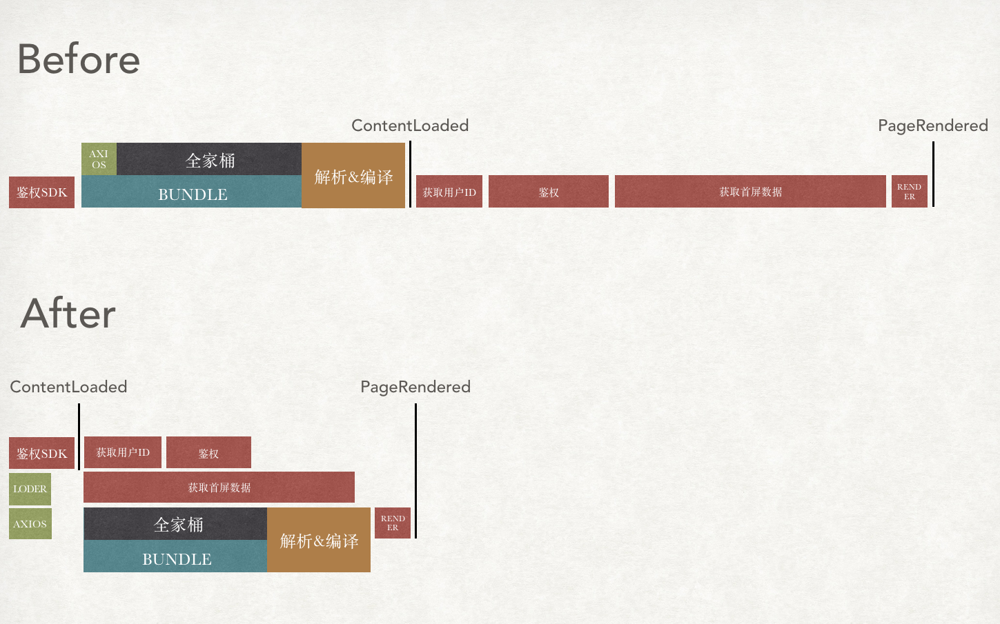

<p align="center">
  <a href="http://loder-docs.scoii.com">
    <h1>Loder</h1>
  </a>
</p>
<p align="center">Extrema Slight Loder, blazing fast bootstrap your application.</p>

<p align="center">
  
  <a href="https://travis-ci.org/yesvods/loder">
    
  </a>
  <a href="https://www.npmjs.com/package/loder">
    
  </a>
</p>

---

* Dead Simple API
* 声明式依赖，极简的资源任务管理
* 极致加载，所有资源都以最适合时刻加载
* 轻量体积(1.4kb Gziped), 极速启动应用
* 几乎无需修改逻辑，简单几步即可加速应用至极致！

## 🔧 引入

```bash
$ npm install loder
```

```js
import loder from 'loder'
```

除此之外，`loder`提供`UMD`方式，直接通过`script`引入

## [LiveDemo](https://jsfiddle.net/dbg5gusu/1/)

## 📦 极简示例

利用懒加载语法`import`，管理资源任务变得异常简单

```js
loder.add('axios', () => import('axios'))

const axios = await loder.echo('axios')
```

读到这里，你已经完全了解`loder`的所有语法！让资源与任务变得异常简单，`loder`将这两者抽象为一个概念：`过程`。

`过程`有很多种形式，通过统一的方式管理`过程`，所有加载变得极其简单。

## 🚅 实际场景

下面以一个实际场景来演示，`loder`如何通过高效执行所有`过程`并启动应用：

* 应用启动

  * 依赖[ "首屏数据", "应用鉴权", "应用 Bundle 加载&执行"]
  * 启动应用

* 应用鉴权

  * 依赖[ "加载鉴权 SDK", "获得用户 ID" ]
  * 发起鉴权请求

* 首屏数据
  * 依赖[ "请求客户端 axios" ]
  * 发起多个请求

应用启动前有一系列`过程`加载：


#### 启动应用前鉴权

```js
// 资源声明
loder.add('authSDK', loder.loadScript('//sample.com/sdk.js'))
loder.add(
  'userId',
  () =>
    new Promise(resolve => {
      resolve('id')
    })
)

// 任务声明
loder.task(
  'auth',
  ['authSDK', 'userId'],
  () =>
    new Promise(resolve => {
      // do auth
      resolve('success')
    })
)
```

#### 加载首屏数据

```js
// 加载请求器
loder.add('axios', () => import('axios'))

// 声明首屏数据
loder.task(
  'fpData',
  ['axios'],
  () =>
    new Promise(resolve => {
      const axios = loder.get('axios')
      return axios('//sample.com/userData.json')
    })
)
```

#### 启动应用

```js
loder.add('createAppFn', () => import('./createAppFn'))

loder.task('bootstrap', ['auth', 'fpData'])

loder.run('bootstrap', async () => {
  const create = await loder.echo('createAppFn')
  create()
})
```

通过非常的简单声明，`loder`不仅仅将`PageLoaded`性能提升至极致，甚至可以利用首屏数据请求期间，去加载应用所需的资源脚本，以及花费大量时间执行的`Bundle`。



## Loder vs SSR

| 特性\方案    | Loder                         | SSR                               |
| ------------ | ----------------------------- | --------------------------------- |
| Server 支持  | 不需要                        | 需要维护额外 SSR 服务器           |
| Server 压力  | 低，正常使用 CDN 方案         | 高，每次请求需 Server 支持        |
| Client       | 无需改动业务逻辑              | client-ssr 两套版本               |
| 通用性       | 任何支持 JS 浏览器            | 简单页面，如客户端鉴权情况不支持  |
| 首屏渲染时间 | 快，无需浪费接口请求时间      | 极快，一次请求可获取首屏内容      |
| 页面空白时间 | 快速启动，极大减少空白时 j 间 | 大数据查询接口，空白时间较长      |
| 可交互时长   | 短，脚本加载完成即可交互      | 中，ssr 后依旧需要完全加载 bundle |

## API

Dead Simple API，`loder`只保留两个核心`API`: `loder()` 和 `loder.echo()`，其灵活性可以满足各种加载场景。

### loder( loderName, pretasks, handler )

Alias `loder.register`、`loder.task`、`loder.add`

`loder`将`资源`和`任务`抽象成`过程`的概念，`任务注册`以及`资源添加`能以统一`API`去声明！

* name
  * 类型：String
  * `loder`名称（任务名称 | 资源名称）
* pretasks
  * 类型：[ String ]
  * 依赖的`loder`名称 \* 如果没有传入`handler`，`pretasks`返回的结果数组会作为此`loder`返回值
* handler( loderResult )
  * 类型：Function

```js
loder.add('axios', () => import('axios'))
loder.task('fetchData', ['axios'], () => {
  const axios = loder.get('axios')
  return axios('sample.com/result.json')
})

// Same as
loder('axios', () => import('axios'))
loder('fetchData', ['axios'], () => {
  const axios = loder.get('axios')
  return axios('sample.com/result.json')
})
```

### loder.echo( loderName, params, handler )

Alias `loder.run`、`loder.load`

同样的`loder`也把`过程`的执行抽象成极简的 API。在代码编写过程，我们也许需要区分`任务`与`资源`,`loder`提供更友好的 API 去触发执行。多次执行同一`loder`返回相同结果。

* name
  * 类型：String | [ String ]
  * `loder`名称
* params
  * 类型：Object
  * 执行`loderName`时候，给`handler`传递`params`参数
  * 执行完第一次后`loderName`结果会被缓存，重复执行`echo`传递不同`params`结果不会变化。需要以新`params`执行，可以使用`loder.reload`。
* handler( loderResult )
  * 类型：Function
* 返回
  * `loderName`执行的结果
  * 如果`handler`传入，则根据`handler`执行结果返回

```js
// 加载资源
const axios = await loder.echo('axios')

// Same as
const axios = await loder.load('axios')

// 执行任务
loder.run('fetchData', response => {
  console.log('APIGet:', response.data)
})
```

### loder.reload( loderName, params, handler )

参数同`loder.echo`，可以新的参数`params`重新加载`loder`（`loder.echo`多次调用结果不会变）

重新执行`loderName`，包括`pretask`，适用于如网络请求重发等场景。

### loder.loadMatch( matchStr )

可以批量加载所匹配的`loder`，适用于首屏渲染完之后，懒加载资源的引入。

* matchStr
  * 类型：String | RegExp
  * 匹配符合的`loder`名称并加载之，懒加载场景有奇效

```js
loder('loder1', () => Promise.resolve('l1'))
loder('loder2', () => Promise.resolve('l2'))
loder('other3', () => Promise.resolve('o3'))

await loder.loadMatch('loder')

const l1 = loder.get('loder1') // l1
const l2 = loder.get('loder2') // l2
const o3 = loder.get('other3') // undefined
```

### loder.get( key )

同步版`loder.echo`。

获取值时候需确保对应`loder`已经执行完毕，否则返回`undefined`

```js
// 执行任务
loder.run('fetchData', response => {
  // 可以确定依赖的axios已经加载完毕
  const axios = loder.get('axios') // Yeah, 不需要await来加载
})
```

### loder.route( name, isHashRouter, handler )

对于 SPA 场景，多入口应用非常常见，`loder`提供`route`方法。智能识别当前路由，并注册相应`loder`。

* name
  * 类型：String
  * 路由匹配符，可以使用通配模式
* isHashRouter
  * 类型：Boolean（默认：false）
  * 是否使用`hash`路由，可以单独配置
  * 也可以通过调用`loder.config({ isHashRouter: true })`，改变默认设置
* handler(params)
  * 类型：Function
  * 参数为通配参数，若非通配形式(比如 `/home`)则为空对象

```js
// 为了保持精细化，loder提供的router版才有此方法
import loder from 'loder/lib/route'

loder.route('/home', () => {
  loder.add('data', fetchHomeData())
})

loder.route('/about', () => {
  loder.add('data', fetchAboutData())
})

loder.route('*', () => {
  loder.add('data', fetchFallBackData())
})

// location.pathname === '/home'
const data = await loder.echo('data') // GET: homeData
```

除此之外，还可以使用通配方式，处理器会带上对应匹配参数：

```
loder.route('/user/:userId', (params) => {
  loder.add('data', fetchUserData({id: params.userId}))
})
// location.pathname === '/user/233'
const data = await loder.echo('data') // GET: 233 user data
```

### loder.loadScript( url, attributes )

工具函数，帮助快速添加外部`script`资源，脚本`onload`触发后`resolve`资源。

```
const {lodeScript} = loder
const scriptUrl = `//cdnjs.cloudflare.com/ajax/libs/axios/${VERSION}/axios.js`
loder.add('axios', () => loadScript(scriptUrl).then(() => return window.axios))
```

### loder.set( key, value )

工具函数，设置公用值，可覆盖`loder`的执行结果。

```js
loder.set('isFirstRendered', false)

// ...rendered
loder.set('isFirstRendered', true) // loder.get('isFirstRendered') => true

// 可以覆盖loder执行的结果
loder.set('axios', 'I am a string axios')
loder.get('axios') // 'I am a string axios'
```
